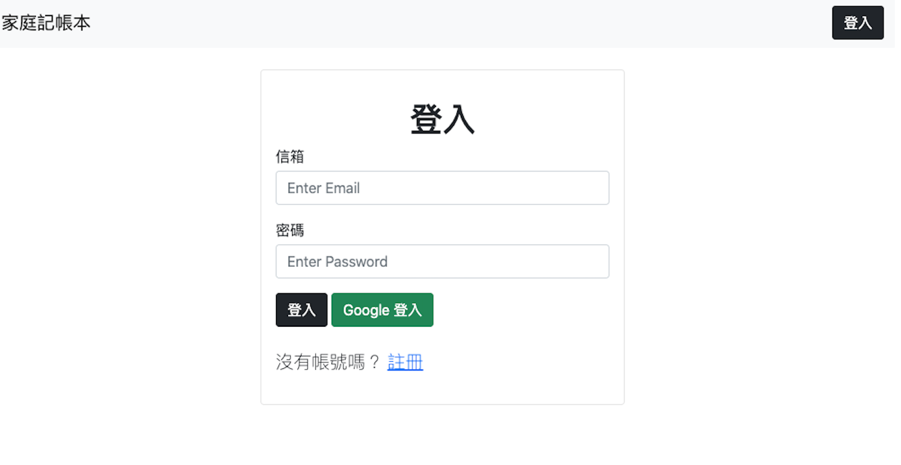
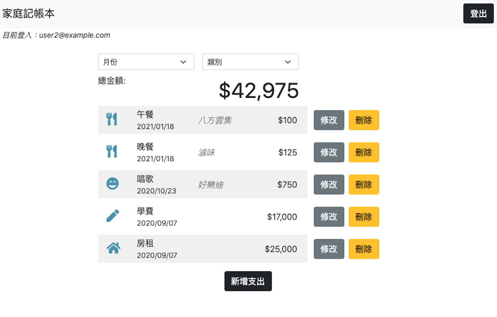

# Expense Tracker
An user authentication & CRUD web application build with `node.js`. 
- web server: `express`
- view engine: `handlebars`
- database: `mongodb` with `mongoose` as ODM

## Host
- The app is hosted with `Heroku` at: https://boiling-cove-29311.herokuapp.com/
- Try with these accounts:
User 1:
```
email: user1@example.com / password: 12345678
```

User 2:
```
email: user2@example.com / password: 12345678
```

## Features
- **Register**: User is able to register an account with email or Google account
- **Login / Logout**: User is able to login and logout
- **Authentication**: User is only able to access his/her own expense tracker
- **Create**: User is able to create an expense
- **Read**: User is able to view all the expenses
- **Update**: User is able to edit an expense
- **Delete**: User is able to delete an expense
- **Filter**: User is able to filter expense by category and by month




## Quick Start
1. Install server depenencies
```
npm install
```
2. Write seed data to database
```
npm run seed
```
3. Run server with nodemon
```
npm run dev
```
4. Browse with browser
```
http://localhost:3000
```
5. Register or try with below seed accounts:

- User 1:
```
email: user1@example.com / password: 12345678
```

- User 2:
```
email: user2@example.com / password: 12345678
```